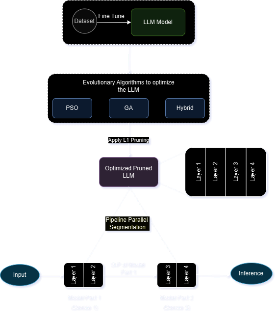
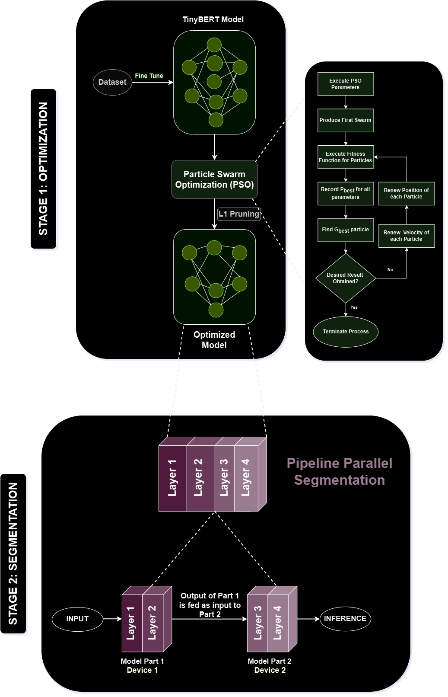

# Optimization and Segmentation of Large Language Models on Edge Devices

This repository contains the implementation of a project aimed at optimizing large language models (LLMs) to run efficiently on edge devices. We applied evolutionary algorithms and model pruning techniques to reduce computational requirements, memory usage, and energy consumption, making LLMs feasible for real-time, low-power environments.

LLMs have become essential in NLP applications such as text generation and language translation, but their size makes deployment on edge devices challenging. This study aims to address these limitations by:
1. **Optimizing LLMs** with evolutionary algorithms.
2. **Segmenting and distributing** the model across devices for parallel execution.
3. **Deploying on Edge Devices** for efficient, low-latency AI capabilities.

## Features

- **Model Optimization**: Using Particle Swarm Optimization (PSO), Genetic Algorithm (GA), and hybrid approaches.
- **Model Pruning**: Applying L1 pruning to reduce model size.
- **Segmentation and Parallelism**: Using pipeline parallelism to distribute model segments across devices.

## Proposed Methodology

The proposed approach is divided into two main parts:

1. **Optimization**: Various optimization techniques, including PSO, GA, and L1 pruning, were applied to make the model lighter and reduce memory usage. These techniques allow the model to run efficiently within the limited resources of edge devices.
  
2. **Segmentation**: After optimization, pipeline parallelism was used to segment the model across multiple devices. By splitting the model and allowing each device to process a segment, we improved processing speed and achieved concurrent execution, making it feasible to deploy large models on resource-constrained environments.

## Final Implementation

## Future Work
Segmenting the model based on system computational power to further optimize performance on devices with varying capabilities.

## Contributors 🚀

- **Manya Hegde** - [GitHub Profile](https://github.com/manyahegde)
- **Chethana R Kini** - [GitHub Profile](https://github.com/chethanarkini)
- **Reyona Elza Sabu** - [GitHub Profile](https://github.com/Reyonaes)

